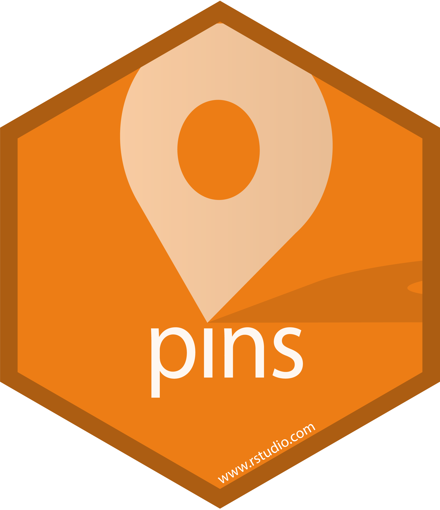

```{r setup, include=FALSE}
options(htmltools.dir.version = FALSE)
library(fontawesome)
```

background-image: url(slides_files/cover.png)
background-size: cover
 
???
---
background-image: url(slides_files/board_alpha_banner.png)
background-position: top
background-size: contain
# Hello, SLC! 👋
.pull-left[
<br><br>
   

[`r fontawesome::fa("twitter")` @katieontheridge](http://twitter.com/katieontheridge)  
[`r fontawesome::fa("github")` @kmasiello](http://github.com/kmasiello)  
[`r fontawesome::fa("link")` kmasiello.rbind.io](https://kmasiello.rbind.io) 
  

  
]  

.column-right[ 
<br>
#We have things in common! 
We love:  
🏔 Mountains <br>
🏞️ Nature <br>
☕ Coffee  <br><br>
📍I bet you'll love pins too
]

---
background-image: url(slides_files/board_alpha_banner.png)
background-position: bottom
background-size: contain
layout: true
---
# What are  ?
> The [pins package](pins.rstudio.com) publishes data, models, and other R objects, making it easy to share them across projects and with your colleagues.

--

<br>
This includes:  
data frames, models, .rds objects, JSON, feather files from the Arrow package...
--
  
 
.center[]

---
layout: false
background-image: url(slides_files/board_alpha_side.png)
background-position: left
background-size: contain
.left-column-impact[
.impactNum[4]<br>
.impactText[signs you might want a pin]

]

.right-column[
<br><br><br><br>

* Do you rely on `read_csv()` to bring in emailed data?  

* Have you lost track of what version is which? *Was it* `dataFINALfinal.csv` *or*  `dataFINALv2.csv`? 🤔

* Do you need to reuse the same data or object across multiple projects or with other people?

* Are you redeploying your app every time the supporting data is updated? 😱

]
---
background-image: url(slides_files/board_alpha_side.png)
background-position: right
background-size: contain

.right-column-impact[
.impactText[

What makes a .larger[good pin?]]
]   
.left-column-wide[
<br><br><br><br><br><br>
* Not *too* big... a few hundred megabytes is plenty  <br>
👉 if it's too big for Excel, it's too big for a pin

* Ephemeral data or reference tables that don't merit being in a database

* Something that needs to be shared or reused

* Something that can be programatically regenerated  

]
---
background-image: url(slides_files/board_alpha_banner.png)
background-position: bottom
background-size: contain
layout: true
---
background-image: url(slides_files/howitworks.png)
background-position: 20% 75%
background-size: contain

# How it works
---
# Let's give it a try

---
layout: false
class: inverse, center, middle
# Pins In Real Life

--

## (or, how pins can make you feel like a rockstar 🤩)  

--

## .smaller[(or at least supercharge your workflow)]

---
background-image: url(slides_files/board_alpha_banner.png)
background-position: bottom
background-size: contain
layout: true
---
# Schedule updates to your pin
💪 Updates happen outside of the Shiny process  
💪 Dashboard users have fresh data without waiting for the ETL


---
# Pin model versions
💪 Make models accessible for downstream consumption 

---
# Common questions
 
* does the pin change the object
* do i have to have an account
* how do I control access

